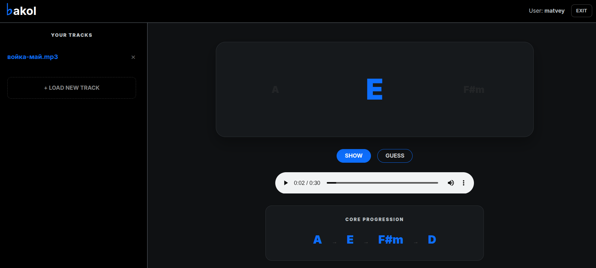

# Bakol

Basic accord listener



## What?

Bakol decomposes any song into progression of the same basic chords.
To make it easier for newbies to learn songs.

##  Why?

It's hard to remember all chords by heart


Most songs are decomposed into the combination of 4 chords [see analysis](https://habr.com/ru/news/902128/)


It's easy to rember chords, if you know that options are very limited


Bakol helps to normalize song to known collection of chords


## How?

### Analysis mode

1. Upload song

2. Analyze audio, extract chords

3. Understand the tune by chords

4. Normaluze tune, normalize chords [transposing script](https://github.com/spyroskantarelis/chordonomicon)

5. Output it!

### Learn mode

1. Analysis, but do not output chords

2. Check user's input

3. Feedback


## Build

```
    pip install -r requirements.txt
```

### CLI

```
    python cli.py my_fav_song.mp3
```

### Django

```
    cd bakol_site
    python manage.py runserver
```
